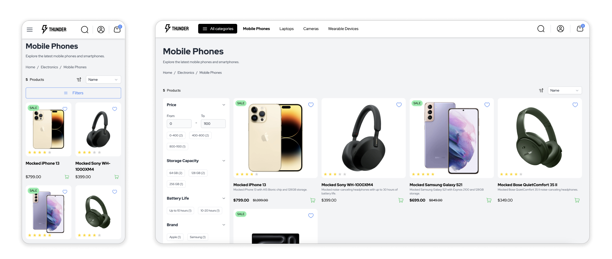

# Thunder Project

> **Note** This is the initial iteration of the project and is currently under active development.

<div>



</div>

## Introduction

A versatile Nuxt 3 application designed to integrate seamlessly with any e-commerce platform. This application serves as a powerful foundation for creating dynamic, scalable, and high-performance online stores, tailored to meet the needs of various businesses. By leveraging the capabilities of Nuxt 3, this solution offers a fast, flexible, and SEO-friendly environment, ideal for modern e-commerce.

## Tech Stack

- **Nuxt 3**
- **Nuxt UI**
- **Tailwind CSS**
- **TypeScript**
- **Swiper**

## What You Need To Know

You can fork this repository and easily replace the underlying **api-mock** layer with your own implementation by connecting the application to any commercial e-commerce provider. This flexibility allows you to integrate your preferred backend services while maintaining the core functionality of the application.

## Architecture

Built on Nuxt 3, it follows a layered architecture, dividing core functionalities into separate, reusable Nuxt layers. These layers are tailored to handle specific aspects of e-commerce applications and can be seamlessly integrated or customized based on individual project requirements.

- **Types (packages/types)**

A collection of common types shared across the storefront and other layers. These types were created to standardize and unify data structures within the project, ensuring compatibility with various e-commerce frameworks.

- **Api Mock Layer (packages/api-mock)**

The API Mock Layer provides a sample e-commerce API designed to serve as a flexible foundation for integrating with your specific platform. This package leverages the Backend for Frontend (BFF) pattern, enabling you to efficiently tailor the data responses to meet the exact requirements of your storefront. By implementing the BFF approach, it ensures that only the necessary data is fetched and transmitted, minimizing overhead and optimizing performance for your application. This layer is highly customizable, allowing seamless integration with various e-commerce backends, making it an ideal starting point for building robust and scalable solutions.

- **SDK Layer (packages/sdk)**

A collection of composables, such as `useCart` and `useCustomer`, designed to handle business logic and manage state efficiently in any Nuxt 3 project. These composables provide a streamlined approach to integrating e-commerce functionalities within your application.

- **Thunder Template (packages/thunder)**

An eCommerce application template built on Nuxt 3, containing ready-to-use components, utilities, helpers, and business logic. This template provides everything you need to quickly develop and customize a fully functional online store, streamlining the development process.

- **Demo Application (apps/demo)**

This demo app showcases the flexibility of the Thunder framework by allowing you to extend the default implementation. It enables the addition of new modules and integrations, leveraging Nuxt's layers mechanism to provide a highly extendable architecture. This setup serves as a practical example of how to customize and scale eCommerce solutions efficiently.

## Getting started

Node.js v20 and pnpm are required to run the project.

```sh
# Install dependencies
pnpm i

# Build packages
pnpm build

# Run project storefront demo
pnpm dev
```
